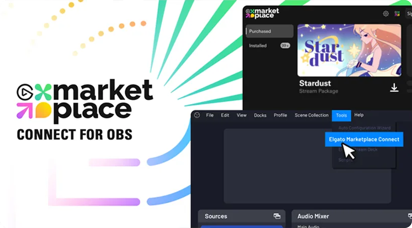

# Marketplace Connect for OBS

[![Elgato homepage](https://img.shields.io/badge/Elgato-3431cf?labelColor=grey&logo=data:image/svg+xml;base64,PHN2ZyByb2xlPSJpbWciIHZpZXdCb3g9IjAgMCAyNCAyNCIgeG1sbnM9Imh0dHA6Ly93d3cudzMub3JnLzIwMDAvc3ZnIj48dGl0bGU+RWxnYXRvPC90aXRsZT48cGF0aCBmaWxsPSIjZmZmZmZmIiBkPSJtMTMuODgxOCA4LjM5NjQuMDI2MS4wMTk2IDkuOTQ5NCA1LjcxNzJjLS40ODg0IDIuNzI5LTEuOTE5NiA1LjIyMjMtNC4wMzg0IDcuMDI1M0ExMS45MjYyIDExLjkyNjIgMCAwIDEgMTIuMDk3IDI0Yy0zLjE5MjUgMC02LjE5MzktMS4yNDc3LTguNDUyNy0zLjUxNDRDMS4zODY4IDE4LjIxODguMTQyNyAxNS4yMDQ0LjE0MjcgMTJjMC0zLjIwNDIgMS4yNDQtNi4yMTg3IDMuNTAxNS04LjQ4NTRDNS45MDE5IDEuMjQ4IDguOTAzMiAwIDEyLjA5NyAwYzIuNDM5NCAwIDQuNzg0Ny43MzMzIDYuNzgzIDIuMTE4NyAxLjk1MjYgMS4zNTQgMy40NDY2IDMuMjM1NyA0LjMyMjcgNS40NDIyLjExMTIuMjgyOS4yMTQ5LjU3MzYuMzA1MS44NjU3bC0yLjEyNTUgMS4yMzU5YTkuNDkyNCA5LjQ5MjQgMCAwIDAtLjI2MTktLjg2OTRjLTEuMzU0LTMuODMwMy00Ljk4MTMtNi40MDQ4LTkuMDIzNy02LjQwNDhDNi44MTcxIDIuMzg4MyAyLjUyMiA2LjcwMDUgMi41MjIgMTJjMCA1LjI5OTUgNC4yOTUgOS42MTE1IDkuNTc0OCA5LjYxMTUgMi4wNTIgMCA0LjAwODQtLjY0NDIgNS42NTk2LTEuODY0NyAxLjYxNzItMS4xOTU1IDIuODAzNi0yLjgzMzcgMy40MzA5LTQuNzM2NGwuMDA2NS0uMDQxOUw5LjU5MDYgOC4zMDQ4djcuMjI1Nmw0LjAwMDQtMi4zMTM4IDIuMDYgMS4xODExLTUuOTk2MiAzLjQ2ODgtMi4xMi0xLjIxMjZWNy4xOTQzbDIuMTE3NC0xLjIyNDUgNC4yMzA5IDIuNDI3OS0uMDAxMy0uMDAxMyIvPjwvc3ZnPg==)](https://elgato.com)

Add and share OBS setups in just a few clicks — with the Marketplace Connect plugin, anyone can stream and produce like a pro. It powers up your OBS workflows, so you can get right to the good stuff.

## System Requirements

To build the plugin locally, you will need the following installed.

-   Windows 10, or higher
-   Visual Studio 17 2022
-   CMake 3.30.5

Please note, Marketplace Connect for OBS is currently only available on Windows.

> [!TIP]
> The plugin uses the OBS plugin template. For more information, please refer to the [OBS Project's wiki](https://github.com/obsproject/obs-plugintemplate/wiki).

## Building

Once all system requirements are installed, follow these steps to build the project and get started with developing.

1. In the project's root folder, run `cmake --preset windows-x64` — this will download the build dependencies and set up a Visual Studio project file in the `build_x64` directory.
2. Open `build_x64/elgato-marketpalce-connect.sln` within Visual Studio to edit and build the project.

Alternatively, `cmake` can build the project directly with the command `cmake --build --preset windows-x64`.

## Further Reading

-   Learn more about the template this project is build on in the [OBS Plugin Template Wiki](https://github.com/obsproject/obs-plugintemplate/wiki).
-   Read about [debugging the project within OBS](https://github.com/obsproject/obs-plugintemplate/wiki/How-To-Debug-Your-Plugin#variant-2-add-plugin-to-obs-studio-project).

> [!NOTE]  
> When debugging with [Variant 2: Add Plugin To OBS Studio Project](https://github.com/obsproject/obs-plugintemplate/wiki/How-To-Debug-Your-Plugin#variant-2-add-plugin-to-obs-studio-project), you will need to add the `plugin`, `plugin-support`, and `elgato-marketplace-connect-loader` projects to the solution.

## Licence

This project is licenced under [GPL-2.0](./LICENSE), and conforms with the requirements outlined by the OBS Project.
